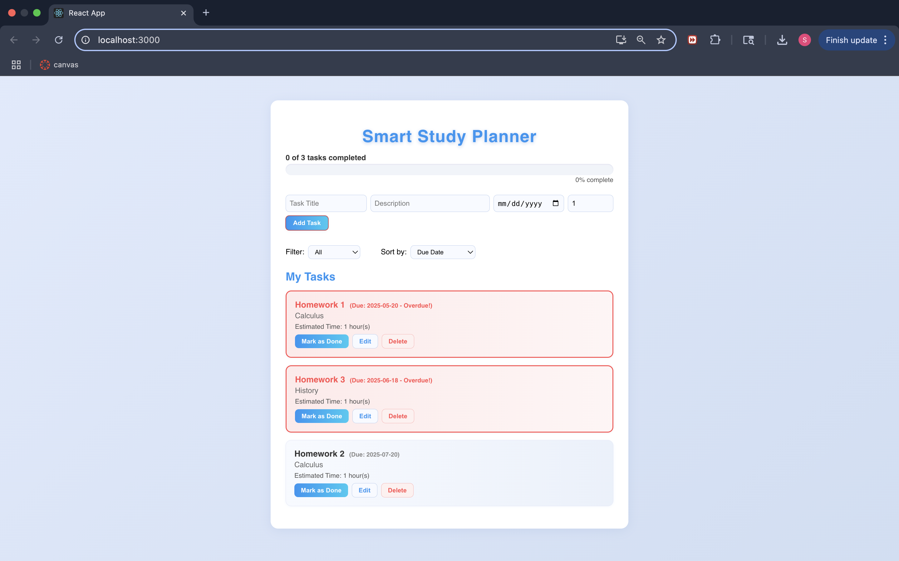

# Smart Study Planner

A modern, visually appealing web app to organize, track, and manage your study tasks.

## Features

- Add, edit, delete, and mark tasks as complete
- Sort and filter tasks by due date, estimated time, or title
- Visual progress bar
- Overdue tasks highlighted in red
- Data persistence with localStorage
- Responsive, user-friendly design

## Screenshots

## Getting Started

1. Clone the repository
2. Install dependencies: # Smart Study Planner

A modern, visually appealing web app to organize, track, and manage your study tasks.

## Features

- Add, edit, delete, and mark tasks as complete
- Sort and filter tasks by due date, estimated time, or title
- Visual progress bar
- Overdue tasks highlighted in red
- Data persistence with localStorage
- Responsive, user-friendly design

## Screenshots

## Getting Started

1. Clone the repository
2. Install dependencies: npm install
3. Start the app: npm start
4. Visit `http://localhost:3000` in your browser

## Tech Stack

- React
- JavaScript
- localStorage

## License

MIT

